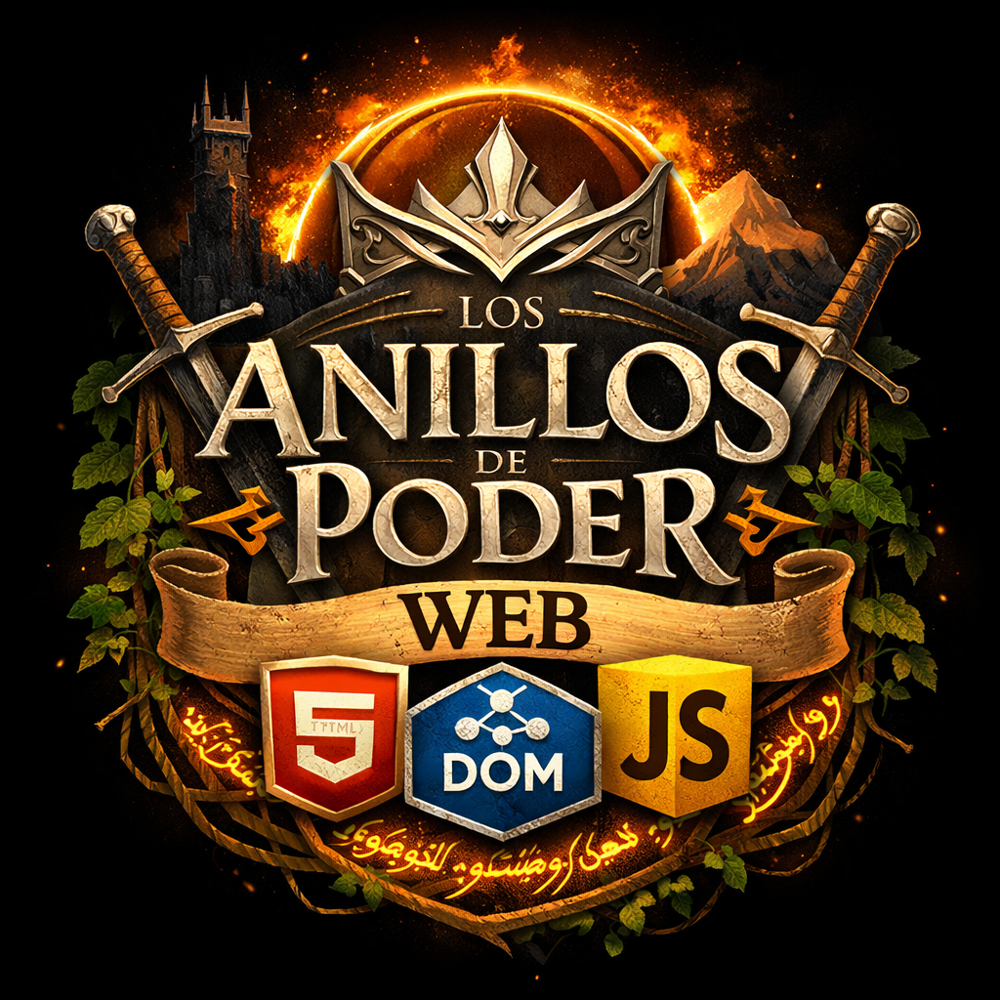

<h1>ANILLOS DE PODER</h1>

## Resultado de aprendizaje evaluado en la actividad:
1.LMSGI.RA3 Accede y manipula documentos web utilizando lenguajes de script de cliente

## Criterios de evaluación evaluados
1.LMSGI.RA3.CR1 a) Se han identificado y clasificado los lenguajes de script de cliente relacionados con la web y sus diferentes versiones y estándares.
1.LMSGI.RA3.CR2 b) Se ha identificado la sintaxis básica de los lenguajes de script de cliente
1.LMSGI.RA3.CR3 c) Se han utilizado métodos para la selección y acceso de los diferentes elementos de un documento web
1.LMSGI.RA3.CR4 d) Se han creado y modificado elementos de documentos web.
1.LMSGI.RA3.CR5 e) Se han eliminado elementos de documentos web.
1.LMSGI.RA3.CR6 f) Se han realizado modificaciones sobre los estilos de un documento web.

## TOTAL DEL RA evaluado en la actividad es del 30%

